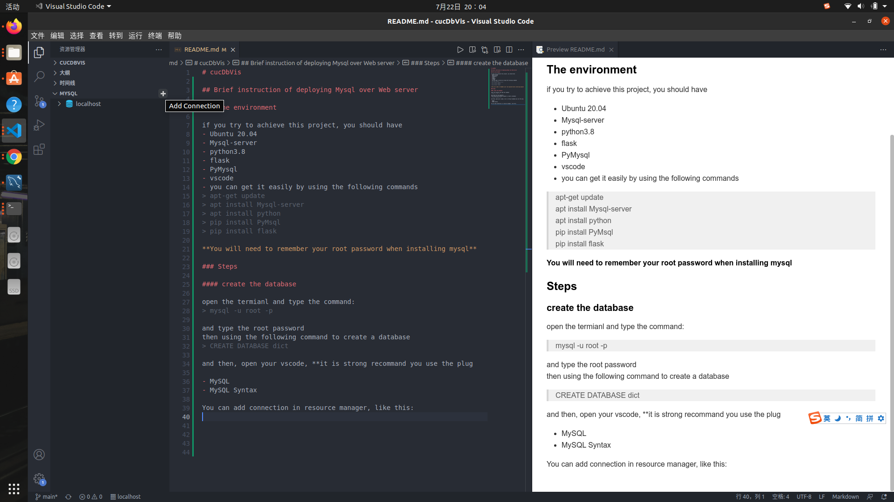
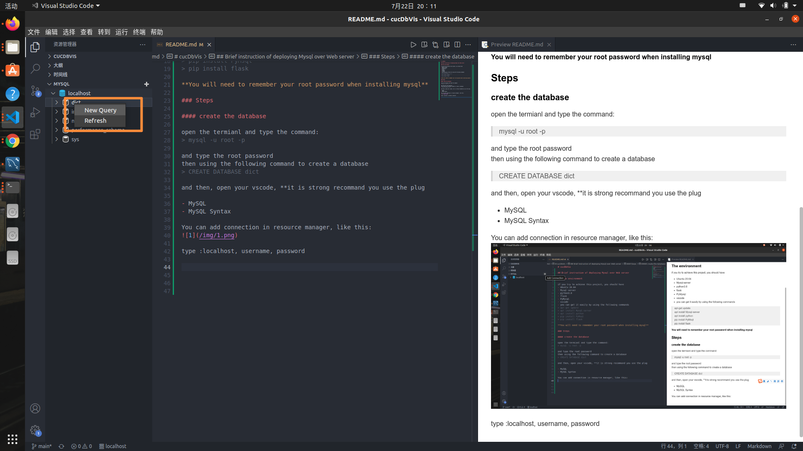
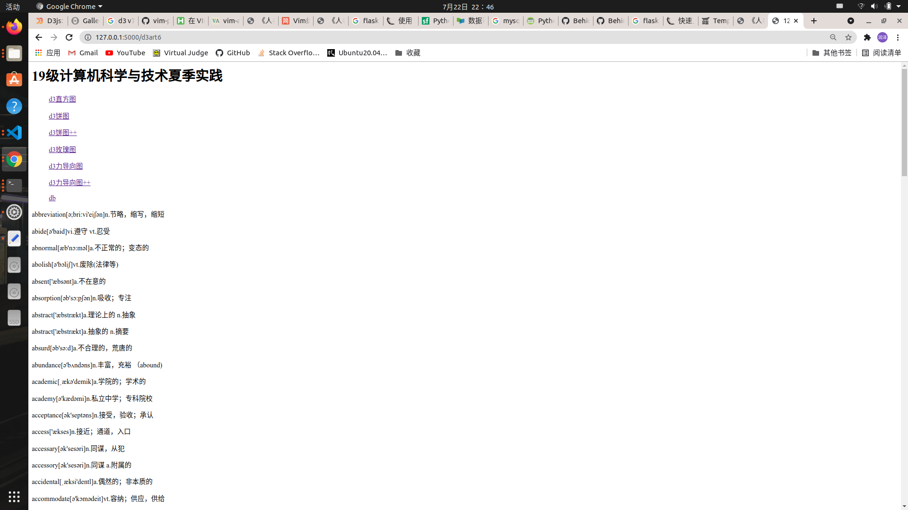

# cucDbVis

## Brief instruction of deploying Mysql over Web server

### The environment

if you try to achieve this project, you should have  
- Ubuntu 20.04 
- Mysql-server
- python3.8 
- flask
- PyMysql
- vscode 
- you can get it easily by using the following commands
```
sudo apt-get update
sudo apt install Mysql-server -y
sudo apt install python -y
pip install PyMsql 
pip install flask
```
**You will need to remember your root password when installing mysql**

### Steps

#### 1. create the database and table

open the termianl and type the command:
```
mysql -u root -p
```

and type the root password
then using the following command to create a database 
```sql
CREATE DATABASE dict
```
and then, open your vscode, **it is strong recommand you use the plug

- MySQL
- MySQL Syntax

You can add connection in resource manager, like this:


type :localhost, username, password


and **Add query**



Copy the contents of the SQL code file given by the teacher into this file

Right click on the **run MySQL Query**
and the you create the database successfully

#### 2. Writing Python Code

The core code in app.py
```py
@app.route('/d3art6')
def d3art6():
    dbhost = "localhost"
    dbuser = "root"
    dbpass = "*******" # 修改
    dbname = "dict"
    db=pymysql.connect(host=dbhost,user=dbuser,password=dbpass,database=dbname)
    sql = "SELECT * FROM `dict`.`map_enword` LIMIT 100;"
    # 使用cursor()方法获取操作游标 
    cursor = db.cursor()
    try:
        # 执行SQL语句
        cursor.execute(sql)
        # 获取所有记录列表
        results = cursor.fetchall()
        # print(results)
        seq = []
        for i in results:
            temp = str(i[1])+str(i[2])+str(i[3])
            seq.append(temp)
            # print(temp)
        return render_template('d3art6.html',seq=seq)
    except:
        print ("Error: unable to fetch data")
    
    db.close()
    return "helloword"
# # 关闭数据库连接
```

### 
#### 1. Svae the project

you can save the project to local by using **git clone**
#### 2. Run
cd to the corresponding folder

Modify the program password part

using this command

``` 
python ./app.py
```

#### 3. Open your Web browser

Enter 127.0.0.1:5000/ in the address box

You can see this in your browser window
  


